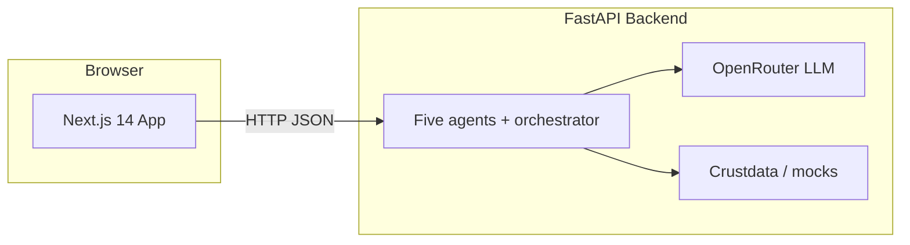

# VC Analyst AI (Always-On VC Analyst)

**VC Analyst AI** is an AI-powered assistant for venture investors. You type a **fund thesis in plain English**; the system structures it, surfaces matching-style startups, **LLM-scores** fit, drafts an **investment memo**, checks **narrative drift**, and exposes an **Ask** tab for open-ended VC Q&A.

**Target user:** associates, principals, or GPs doing first-pass screening and diligence.  
**Design goal:** **one primary input** (the thesis) for the main workflow, plus optional API keys for live data/LLM.

---

## Table of contents

- [Architecture](#architecture)
- [AI integration](#ai-integration)
- [Quick start (local)](#quick-start-local)
- [Docker](#docker)
- [Deployment (DigitalOcean & others)](#deployment-digitalocean--others)
- [Test datasets & demonstration](#test-datasets--demonstration)
- [Documentation](#documentation)
- [Project layout](#project-layout)

---

## Architecture



| Layer | Stack | Role |
|-------|--------|------|
| **Frontend** | Next.js 14, TypeScript, Tailwind | Thesis form, results, memo, drift, **Ask** (`/chat`); rewrites `/api/*` to FastAPI (local + production). |
| **Backend** | FastAPI, Python 3.12, Pydantic | REST API, background analysis jobs, agent orchestration. |
| **Model access** | OpenAI-compatible client → [OpenRouter](https://openrouter.ai) | Parsing, scoring, memo, drift, chat. Default model family configured in `backend/app/config/settings.py`. |
| **Data** | Crustdata (optional), in-app mocks | Startup discovery; safe offline demo via `USE_MOCK=true`. |

Persistent analysis jobs (for long runs) are written under `backend/.analysis_jobs/` so `uvicorn --reload` does not lose polling state.

---

## AI integration

| Feature | AI? | Implementation |
|---------|-----|----------------|
| Thesis → structured criteria | Yes | `thesis_parser_agent` → `run_structured_llm` (fallback rules if no key/mock). |
| Startup fit scores | Yes | `thesis_match_agent` scores five dimensions (0–100). |
| Investment memo | Yes | `memo_generation_agent`. |
| Narrative drift | Yes | `narrative_drift_agent`. |
| **Ask** | Yes | `POST /api/chat` → `run_llm` with VC-analyst system prompt. |
| Offline demo | Deterministic fixture | `USE_MOCK=true` or `NEXT_PUBLIC_DEMO_MODE=true` uses baked JSON (no external LLM). |

API explorer (when running): **http://localhost:8000/docs**

---

## Quick start (local)

### Prerequisites

- **Node.js 18+**
- **Python 3.11+** (3.12 recommended; matches Docker image)
- Optional: **OpenRouter** API key for live LLM

### 1. Environment

Copy secrets from `.env.example`:

- **`backend/.env`** — at minimum set `OPENROUTER_API_KEY` (or leave `USE_MOCK=true` for fixture-only runs).
- **`frontend/.env.local`** — e.g.  
  `NEXT_PUBLIC_API_URL=http://127.0.0.1:8000`  
  `NEXT_PUBLIC_DEMO_MODE=false`  
  (Use `NEXT_PUBLIC_DEMO_MODE=true` only for a purely offline UI demo without Python.)

### 2. Backend

```bash
cd backend
python -m venv .venv
source .venv/bin/activate    # Windows: .venv\Scripts\activate
pip install -r requirements.txt
# ensure backend/.env exists
uvicorn app.main:app --reload --host 0.0.0.0 --port ${PORT:-8000}
```

On **DigitalOcean App Platform**, the API container must bind to the **`PORT`** env the platform provides (the Dockerfile already uses `uvicorn ... --port ${PORT:-8000}`). Your App Spec **`http_port`** must match that listening port (e.g. `8000`).

### 3. Frontend

```bash
cd frontend
npm install
npm run dev
```

Open **http://localhost:3000** — use **Thesis** for the pipeline or **Ask** for chat.

### Clean rebuild (Next.js cache issues)

```bash
cd frontend && npm run clean && npm run dev
```

---

## Docker

Run the API in a container (create `backend/.env` first):

```bash
docker compose up --build
```

Then start the frontend locally pointed at the API:

```bash
cd frontend
NEXT_PUBLIC_API_URL=http://127.0.0.1:8000 NEXT_PUBLIC_DEMO_MODE=false npm run dev
```

---

## Deployment (DigitalOcean & others)

### DigitalOcean App Platform (recommended for this repo)

- **Spec:** [`.do/app.yaml`](.do/app.yaml) — two services (`api` + `web`) with `source_dir` set to `backend` and `frontend`.

The browser calls **same-origin** `/api/...`; the Next **App Route** `src/app/api/[...path]/route.ts` proxies to your FastAPI using env (read at **runtime**, so you don’t have to rebuild the frontend when the API URL changes):

| Variable | Where | Purpose |
|----------|--------|--------|
| **`BACKEND_URL`** | **Web** service (RUN_TIME) | API component base: origin + optional path prefix, e.g. `https://your-app.ondigitalocean.app/vc-analyst-backend` or `${api.PUBLIC_URL}`. **No trailing slash** and **do not** end with `/api` (the app appends `/api/...`). |
| **`APP_URL_PREFIX`** | **API** service | Must match the component route: e.g. `/vc-analyst-backend` so `/vc-analyst-backend/api/...` is handled. Omit locally. |
| **`GATEWAY_STRIPS_API_PREFIX`** | **API** service | `true` when DigitalOcean routes `/api` to this service **with path trimmed** (see Networking). Omit locally. |
| **`NEXT_PUBLIC_API_URL`** | Web (optional) | Same as `BACKEND_URL` if you don’t set `BACKEND_URL`; also used if `NEXT_PUBLIC_API_DIRECT=true`. |
| **`OPENROUTER_API_KEY`** | **API** service (SECRET) | LLM + agents. |

Set **`CORS_ORIGINS`** on the API only if the browser calls the API host directly (`NEXT_PUBLIC_API_DIRECT=true`).

**DigitalOcean path routing:** If **Networking** sends `/api/*` to the API component with **path trimmed**, the container sees `/start-analysis`, not `/api/start-analysis`. Set **`GATEWAY_STRIPS_API_PREFIX=true`** on the **API** service (see `backend/app/main.py`). In that setup, **`BACKEND_URL` on the web service can be the same origin** as the app (e.g. `https://your-app.ondigitalocean.app`): the edge still routes `/api/...` to FastAPI.

If you **don’t** use trimmed `/api` routing, **`BACKEND_URL`** should be the API component’s own URL (e.g. `${api.PUBLIC_URL}`), not the web-only hostname, or the proxy can call the wrong service. **`NEXT_PUBLIC_*` values must be full URLs** (`https://…`); host-only strings are normalized when possible.

### Other hosts (Railway, Render, Fly, Vercel, …)

Deploy the API from `backend/Dockerfile`, the web from `frontend/Dockerfile`, and set **`BACKEND_URL`** on the web container to the API’s public base URL.

---

## Test datasets & demonstration

We ship **three** curated JSON datasets under **`datasets/`**:

| File | Intent |
|------|--------|
| `dataset_01_devtools_preseed.json` | Full pipeline demo; aligns with the built-in **mock** fixture. |
| `dataset_02_vertical_enterprise_saas.json` | Alternate thesis wording (vertical SaaS). |
| `dataset_03_fintech_infrastructure.json` | Fintech thesis + chat-oriented smoke test payload. |

**Index:** [datasets/INDEX.md](datasets/INDEX.md)

**Step-by-step demos:** [docs/DEMONSTRATION.md](docs/DEMONSTRATION.md)

**Automated smoke test** (backend must be running):

```bash
python scripts/verify_datasets.py --base-url http://127.0.0.1:8000
```

---

## Documentation

| Document | Contents |
|----------|----------|
| [docs/CODEBOOK.md](docs/CODEBOOK.md) | User, use case, variable definitions, dataset schema, env vars |
| [docs/DEMONSTRATION.md](docs/DEMONSTRATION.md) | Grader-friendly scenarios A–C + optional recording checklist |
| [datasets/INDEX.md](datasets/INDEX.md) | Dataset catalog |

---

## Project layout

```
backend/           FastAPI app, agents, job persistence, Dockerfile
frontend/          Next.js UI
datasets/          Test datasets (JSON) + INDEX
docs/              Codebook + demonstration guide
scripts/           verify_datasets.py
docker-compose.yml API service
```

---

## Core workflow (UI)

1. Enter thesis → **Run analysis** (async job + polling).  
2. **Results** — ranked startups and fit dimensions.  
3. **Memo** / **Drift** — generated narrative outputs.  
4. **Ask** — free-form VC Q&A with markdown rendering.

---

## License / course submission

Push this repository to GitHub when required and add the public link plus a deployed app URL per instructor instructions.
